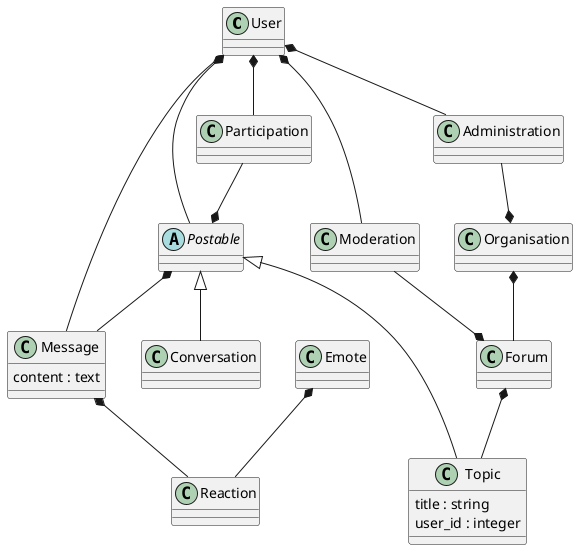

```puml
@startuml
class User
class Message {
  content : text
}
abstract class Postable
class Topic {
  title : string
  user_id : integer
}
class Conversation {

}
class Participation {
}
class Organisation
class Forum

Postable <|-- Topic
Postable <|-- Conversation
Moderation --* Forum
User *-- Moderation
Administration --* Organisation
User *-- Administration
Postable *-- Message
Participation --* Postable
User *-- Participation
Message *-- Reaction
Emote *-- Reaction
Organisation *-- Forum
Forum *-- Topic
User *-- Postable
User *-- Message

@enduml
```
